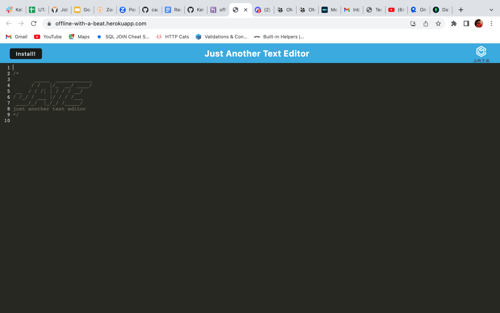

# offline-with-a-beat
PWA text editor.

## Description

I was motivated to complete this project because I wanted to learn more about PWA. I built this project so user could use an note pad and download it to be used offline. This could be useful to a user with bad wifi or no wifi by being fully functional offline.

## Table of Contents (Optional)

If your README is long, add a table of contents to make it easy for users to find what they need.

- [Installation](#installation)
- [Usage](#usage)
- [Credits](#credits)
- [License](#license)
- [Video](#Video)

## Installation

Click Install on the webpage.

## Usage

Use in browser online or download for offline capibilities by clicking install. Then take notes.

## Credits

N/A

## License

MIT License

## Webpage

https://offline-with-a-beat.herokuapp.com/

